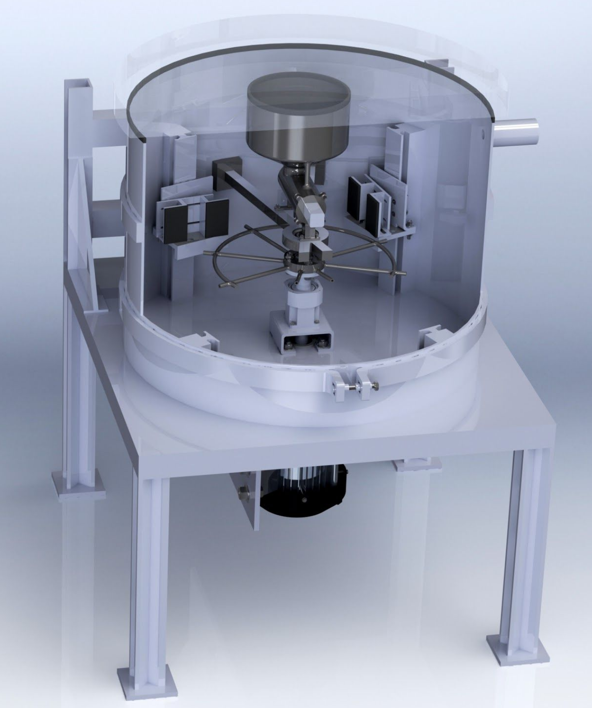

# Project Abstract: Abrasive Jet Micromachining

Abrasive Jet Micromachining is an innovative process used to precision machine hard and brittle materials, such as glasses and ceramics, which are traditionally challenging to fabricate using conventional methods. This process employs a focused stream of pressurized air to accelerate micro-abrasive particles, allowing for the mechanical etching of workpieces without generating heat or adversely affecting their properties.

## The 'Blast Lag' Challenge

One significant challenge in abrasive jet micromachining is the occurrence of 'Blast lag.' This phenomenon is observed when the jet stream results in channels that are shallower than wider ones, resulting in a V-shaped cross-sectional profile. This effect primarily stems from the brittle fracture of the substrate during erosion.

## Eliminating 'Blast Lag'

To address the 'Blast lag' issue, our project focuses on reducing abrasive particle size to below 10 μm. This reduction transforms the erosion behavior from ductile to brittle, eliminating the 'Blast lag' phenomenon and resulting in a desired U-shaped profile.

## Aerodynamic Effects and Vacuum Machining

However, working with particles below 10 μm introduces aerodynamic challenges, where particles tend to follow fluid streamlines instead of striking the surface. These aerodynamic effects can be effectively negated by conducting the machining process within a vacuum.

## Team 'CASE' and the Proposed Solution

In this thesis project, Team 'CASE' embarks on a comprehensive design process to address the challenges outlined above. Our proposed solution involves the creation of a mechanism that utilizes a whirling arm, as opposed to an air jet, to accelerate the abrasive particles. By executing the process within a vacuum chamber, we substantially reduce aerodynamic effects. This approach allows the device to operate at a lower speed while achieving the desired particle acceleration.

## My Contributions

Within Team 'CASE,' I assumed a pivotal role in several aspects of the project:

- **Material Selection:** I conducted extensive research to identify the most suitable material for the abrasive particles, considering key factors such as hardness, abrasiveness, and wear resistance.

- **Mechanical Design:** I played a significant role in the 3D design of the mechanism, ensuring its functionality, efficiency, and reliability.

- **Shaft Diameter Calculation:** My responsibilities included calculating the minimum shaft diameter necessary to prevent fatigue failure, thus ensuring the safety and longevity of the device.

- **3D Design Work:** I contributed significantly to the project's 3D design work, enabling us to visualize and refine our proposed mechanism.

## Final Assembly and Report

You can view the final assembly of our design, created using SolidWorks, below.

For a more detailed understanding of our project, including in-depth findings and analyses, please refer to the comprehensive report provided herein.

Thank you for your interest in our project, and we hope our efforts contribute to advancements in abrasive jet micromachining technology.
